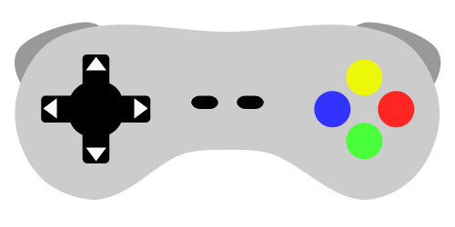

# MauiGamingInputCheckerApp
An application for checking game controllers (gamepads) to confirm button operation. DirectInput is not supported. I have checked the app works fine for Xbox controllers and Razer Kishi (for Android) controllers. 



## Files edited

 - CustomViews/
     - [GamingInputView.xaml](./MauiGamingInputCheckerApp/CustomViews/GamingInputView.xaml)
     - [GamingInputView.xaml.cs](./MauiGamingInputCheckerApp/CustomViews/GamingInputView.xaml.cs)
 - Models/
     - [GamingInput.cs](./MauiGamingInputCheckerApp/Models/GamingInput.cs)
     - [GamingInputArgs.cs](./MauiGamingInputCheckerApp/Models/GamingInputArgs.cs)
 - Platforms/
     - Android/
         - [GamingInputService.cs](./MauiGamingInputCheckerApp/Platforms/Android/GamingInputService.cs)
         - [MainActivity.cs](./MauiGamingInputCheckerApp/Platforms/Android/MainActivity.cs)
     - Windows/
         - [GamingInputService.cs](./MauiGamingInputCheckerApp/Platforms/Windows/GamingInputService.cs)
 - Resources/
     - Images/
         - Controller/
 - Services/
     - [GamingInputService.cs](./MauiGamingInputCheckerApp/Services/GamingInputService.cs)
 - [MainPage.xaml](./MauiGamingInputCheckerApp/MainPage.xaml)
 - [MainPage.xaml.cs](./MauiGamingInputCheckerApp/MainPage.xaml.cs)

## What I learnt from this project

- How to access input devices (in different platforms)
- How to debug remotely on Android
- How to draw simple shapes in Inkscape
- Basic ways to work with Visual studio and Github
- Breakpoint debugging in Visual studio
- How to use Enum with Flags attribute

### SVG decomposition
In Inkscape or same kind of vector image editors, a image (SVG) is composed by several layers and objects. To use such image as VisualElement in MAUI, we perhaps decompose the image into several files with the individual objects/layers. My first attempt was very time consuming approach, that is, I manually saved objects by switching visibility property for all indivisual ones on the original image. This motivate me to develop the tool to decompose SVG image automatically (The repository to be uploaded later). The decomposition tool can report the positions of each object in the original SVG image, for use as anchor points for animation.

```xml
<Image x:Name="KEY_START" Source="button_start.png" 
               AnchorX="0.55" AnchorY="0.45"/>
<Image x:Name="KEY_SELECT" Source="button_select.png" 
               AnchorX="0.45" AnchorY="0.45"/>
```

## Known Issues

- ~~Page view turns darker after generic motion event triggered by directional keys or left analog stick~~
- ~~Animation of right shoulder (Path) shows unexpected behavior (off-centered)~~

## TODO

- [x] Multiple controllers support 
- [ ] Analog sticks support
- [ ] Switch controllers support